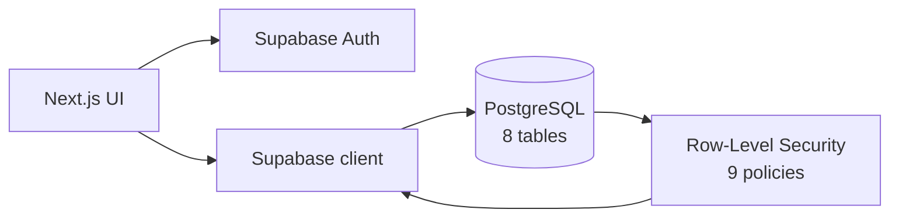

<h1 align="center">Command Center</h1>

<p align="center"><i>A personal productivity hub — projects, tasks, pomodoro and notes — built full-stack on Next.js and Supabase.</i></p>

<p align="center">
  
  
  
  
  
  
</p>

<p align="center">
  🚀 <a href="https://command-center-app-sigma.vercel.app"><b>Live demo</b></a>
</p>

## The problem

I wanted one place to run my day — projects, tasks, focus timer and notes — without stitching together five SaaS tools. Command Center is that hub, and it doubles as a real full-stack build: authentication, a relational schema, and **row-level security done properly** so each user only ever sees their own data.

## Features

- **Projects, tasks, pomodoro timer and notes** in a single dashboard.
- **Auth + multi-user** — every record is scoped to its owner.
- **8 Postgres tables with 9 row-level-security policies** — data isolation enforced at the database, not just the UI.
- **Deployed on Vercel**, backed by Supabase.

## Architecture



## Quickstart

```bash
git clone https://github.com/akhanER2000/command-center-app.git
cd command-center-app
npm install
cp .env.example .env.local   # add your Supabase URL + anon key
npm run dev
```

## Stack

TypeScript · Next.js · React · Supabase · PostgreSQL · Tailwind CSS

## Results

- **8 relational tables**, **9 RLS policies** — tenant isolation guaranteed server-side.

## Status & roadmap

`status: flagship` · active, deployed. Next: recurring tasks and calendar view.

## License & contact

MIT © 2026 Akhan Lorenzo Espinoza Rojas
[Portfolio](https://cs-portfolio-psi-topaz.vercel.app) · [LinkedIn](https://www.linkedin.com/in/akhan-espinoza)
